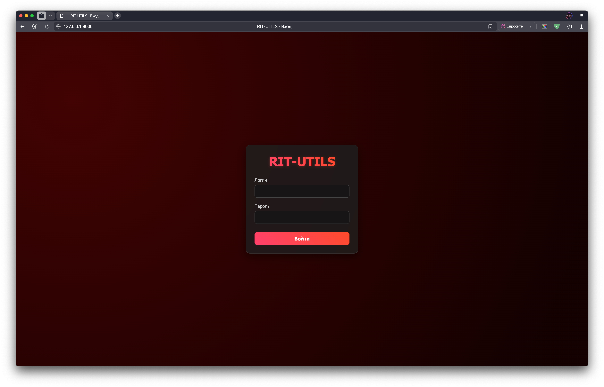
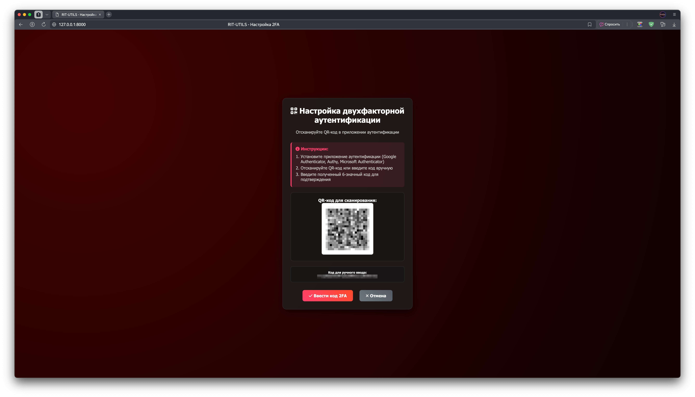
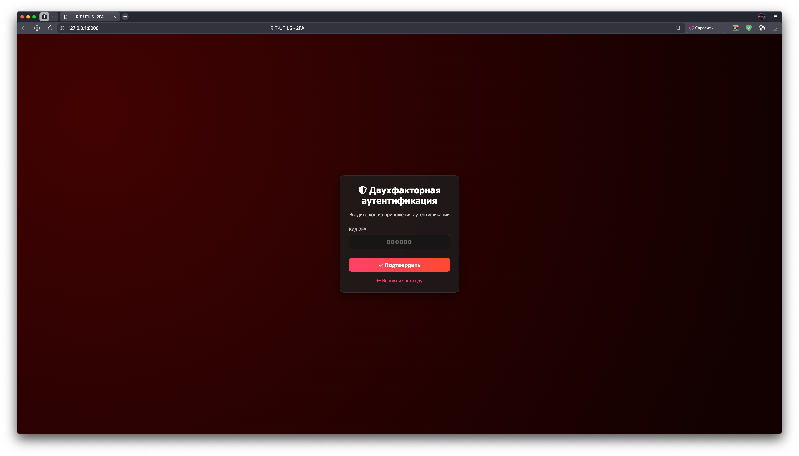
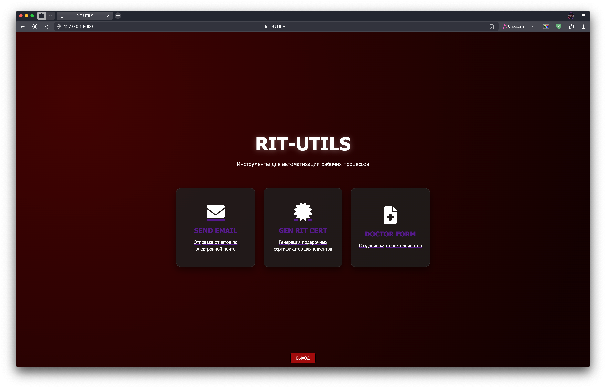
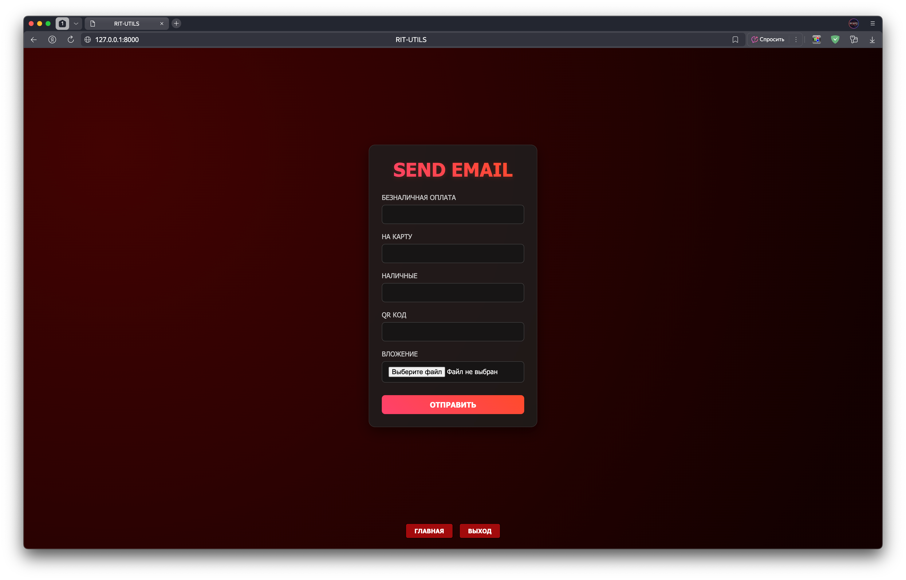
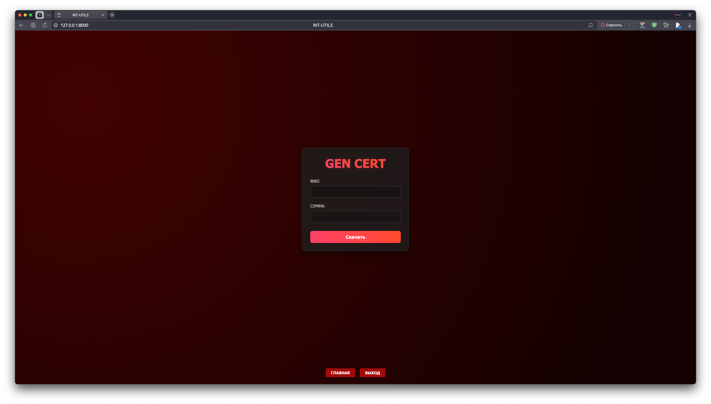
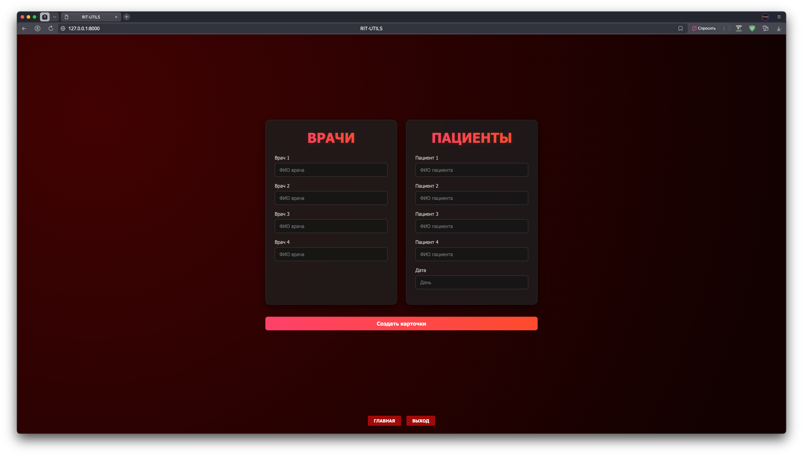

# rit-utils


Веб-приложение на FastAPI для автоматизации рабочих процессов.

## 📝 Описание

Проект предоставляет набор утилит для автоматизации рабочих процессов, включая:
- 🔐 Двухфакторная аутентификация (2FA) через TOTP (Google Authenticator, Authy и др.)
- 📄 Генерацию сертификатов
- 🏥 Обработку форм
- 📧 Отправку email-уведомлений с вложениями
- 🛡️ JWT-авторизацию с refresh токенами

## 🔐 Безопасность

Приложение защищено многоуровневой системой аутентификации:
- **Логин/пароль** - первый уровень защиты
- **2FA TOTP** - второй уровень через приложения аутентификации
- **JWT токены** - защищенные сессии с автоматическим обновлением
- **Secure cookies** - защита от XSS и CSRF атак

## 🚀 Быстрый старт

### Требования
- Python 3.13
- Poetry (для управления зависимостями)

### Установка
1. Клонируйте репозиторий:
   ```bash
   git clone https://github.com/your-repo/rit-utils.git
   cd rit-utils
   ```

2. Установите зависимости:
   ```bash
   poetry install
   ```

3. Добавьте необходимые файлы:
   Перед запуском добавьте требуемые файлы шаблонов в соответствующие директории (см. раздел "Дополнительные файлы").

4. Настройте переменные окружения:
   ```bash
   cp .env.examples .env
   nano .env  # Отредактируйте переменные окружения
   ```
   
   **Обязательно настройте:**
   - `LOGIN` и `PASSWORD` - учетные данные для входа
   - `SEND_FROM` и `EMAIL_PASS` - настройки почты
   - `JWT_SECRET_KEY` - секретный ключ для JWT
   - `TOTP_SECRET` - секрет для 2FA (сгенерируйте новый)

5. Настройте 2FA:
   - При первом входе система предложит настроить 2FA
   - Отсканируйте QR-код или введите секрет вручную в приложение аутентификации
   - 2FA настраивается один раз и сохраняется навсегда

### Запуск

**Локальная разработка**
```bash
poetry run uvicorn src.main:app --reload
```

**Продакшен через Docker**
```bash
docker-compose up -d
```

Приложение будет доступно по адресу: [http://localhost:8000](http://localhost:8000)

## 🚀 Развертывание на сервере

### Автоматическое развертывание на Ubuntu 22.04

```bash
# 1. Клонирование репозитория
git clone <your-repo-url>
cd rit-utils

# 2. Запуск универсального скрипта развертывания
sudo ./deploy.sh
```

**Скрипт автоматически:**
- Установит Docker и Docker Compose
- Спросит ваш домен (или настроит только HTTP)
- Настроит nginx и HTTPS (если указан домен)
- Развернет приложение
- Настроит автообновление SSL сертификатов

## 🐳 Docker

### Локальная разработка
```bash
# Сборка и запуск
docker-compose up -d

# Просмотр логов
docker-compose logs -f

# Остановка
docker-compose down
```

## ⚙️ Конфигурация

### Переменные окружения (.env)
```bash
# Email настройки
SEND_FROM=your_email@yandex.ru
EMAIL_PASS=your_password
ADDR_TO=recipient@example.com
BCC_TO=bcc@example.com

# Учетные данные для входа
LOGIN=admin
PASSWORD=your-admin-password

# JWT настройки  
JWT_SECRET_KEY=your-super-secret-jwt-key-here

# 2FA настройки (обязательно)
TOTP_SECRET=your-custom-totp-secret
```

### Генерация TOTP секрета
TOTP_SECRET должен быть Base32 строкой. Для генерации секрета:
```bash
python -c "import pyotp; print(pyotp.random_base32())"
```

**Важно**: 
- TOTP_SECRET должен содержать только символы A-Z и цифры 2-7 (Base32)
- Рекомендуемая длина: 32 символа
- Если указать некорректный секрет, 2FA не будет работать

**Примечание**: JWT токены истекают через 15 минут, refresh токены - через 7 дней. Эти настройки жестко закодированы в коде.

## 📚 Документация

После запуска приложения доступна автоматически сгенерированная документация API:
- Swagger UI: [/docs](http://localhost:8000/docs)
- ReDoc: [/redoc](http://localhost:8000/redoc)

## 🔐 Процесс аутентификации

1. **Вход** → Введите логин/пароль
2. **Настройка 2FA** (только при первом входе):
   - Отсканируйте QR-код в приложении аутентификации
   - Или введите секрет вручную
   - Настройка сохраняется навсегда
3. **Ввод 2FA кода** → Введите 6-значный код из приложения
4. **Доступ к приложению** → Получение JWT токенов и доступ к функциям

### Поддерживаемые приложения 2FA
- Google Authenticator
- Яндекс.Ключ
- Microsoft Authenticator
- Authy
- 1Password
- Любое приложение с поддержкой TOTP

## 📸 Скриншоты приложения

**Авторизация:**



**Настройка 2FA:**



**Ввод пароля 2FA:**



**Главный экран:**



**Отправка письма:**



**Генерация сертификата:**



**Создание карточек:**



## 🏗️ Структура проекта
```
rit-utils/
├── src/                          # Исходный код приложения
│   ├── main.py                  # Основное FastAPI приложение
│   ├── config.py                # Конфигурация и загрузка переменных окружения
│   ├── auth/                    # Модуль аутентификации
│   │   ├── __init__.py          # Экспорт функций авторизации
│   │   ├── login.py             # JWT авторизация и сессии
│   │   ├── routes.py            # Роуты 2FA
│   │   └── two_factor.py        # 2FA TOTP функциональность
│   └── utils/                   # Утилиты
│       ├── __init__.py          # Экспорт утилит
│       ├── doctor_form/         # Модуль генерации карточек врача
│       │   └── doctor_form_handler.py  # Обработчик формы врача
│       ├── gen_cert/            # Модуль генерации сертификатов
│       │   └── gen_cert_handler.py     # Обработчик сертификатов
│       └── send_email/          # Модуль отправки email
│           ├── email_handler.py        # Обработчик отправки email
│           └── email_templates_examples.py # Примеры шаблонов
├── templates/                   # Jinja2 шаблоны
│   ├── css/                     # Стили CSS
│   │   ├── style_home.css       # Стили главной страницы
│   │   ├── style_login.css      # Стили страниц входа и 2FA
│   │   └── style_utils.css      # Стили утилит
│   ├── login.html               # Страница входа
│   ├── two_factor.html          # Страница ввода 2FA кода
│   ├── setup_2fa.html           # Страница настройки 2FA
│   ├── home.html                # Главная страница
│   ├── send_email.html          # Отправка email
│   ├── gen_rit_cert.html        # Генерация сертификатов
│   ├── doctor_form.html         # Форма врача
│   ├── footer.html              # Подвал страниц
│   └── token-refresh.js         # Обновление JWT токенов
├── screenshots/                 # Скриншоты приложения
│   ├── auth.png                 # Страница авторизации
│   ├── 2fa_setup.png            # Настройка 2FA
│   ├── 2fa.png                  # Ввод кода 2FA
│   ├── home.png                 # Главная страница
│   ├── send_email.png           # Отправка email
│   ├── gen_cert.png             # Генерация сертификатов
│   └── doctor_form.png          # Форма врача
├── nginx/                      # Конфигурация Nginx
│   ├── nginx.conf              # Основная конфигурация Nginx
│   └── conf.d/                 # Конфигурации виртуальных хостов
│       └── rit-utils.conf      # Конфигурация для приложения
├── .env.examples               # Пример конфигурации переменных окружения
├── docker-compose.yml          # Docker Compose конфигурация
├── Dockerfile                  # Docker образ приложения  
├── deploy.sh                   # Универсальный скрипт развертывания (HTTP/HTTPS)
├── pyproject.toml              # Конфигурация Poetry
├── poetry.lock                 # Зафиксированные версии зависимостей
├── LICENSE                     # Лицензия Apache 2.0
└── README.md                   # Документация проекта
```

### 📋 Дополнительные файлы (не в репозитории)

Для полноценной работы проекта требуются дополнительные файлы, которые содержат конфиденциальную информацию и не включены в репозиторий:

- `src/utils/doctor_form/Бланк Врача.pptx` - шаблон презентации для карточек врача
- `src/utils/doctor_form/Бланк врача на печать.pptx` - готовый шаблон для печати
- `src/utils/gen_cert/Сертификат_шаблон.pptx` - шаблон сертификата
- `src/utils/send_email/email_templates.py` - настроенные email шаблоны

**Примечание**: Эти файлы необходимо добавить вручную для корректной работы всех функций приложения.

## 📦 Зависимости

### Основные зависимости:
- **FastAPI** (^0.116.1) - веб-фреймворк
- **Uvicorn** (^0.35.0) - ASGI сервер
- **AuthX** (^1.4.3) - JWT аутентификация
- **PyOTP** (^2.9.0) - TOTP двухфакторная аутентификация
- **QRCode** (^7.4.2) - генерация QR-кодов для 2FA
- **Python-multipart** (^0.0.20) - обработка форм и файлов
- **Python-dotenv** (^1.1.1) - работа с переменными окружения
- **Jinja2** (^3.1.6) - шаблонизатор HTML
- **Python-pptx** (^0.6.23) - работа с PowerPoint файлами
- **Pillow** (^10.1.0) - обработка изображений

Полный список зависимостей можно найти в [pyproject.toml](./pyproject.toml)

## 🛡️ Безопасность

### Рекомендации по безопасности:
1. **Используйте сильные пароли** для всех учетных записей
2. **Регулярно обновляйте JWT_SECRET_KEY** в production
3. **Настройте HTTPS** в production окружении
4. **Включите файрволл** и ограничьте доступ к порту 8000
5. **Регулярно обновляйте зависимости** через `poetry update`
6. **Не коммитьте .env файл** в репозиторий

### Настройки безопасности:
- JWT токены истекают через 15 минут (настраивается)
- Refresh токены истекают через 7 дней
- 2FA настройка сохраняется навсегда
- Все cookies защищены флагами `httponly`, `secure`, `samesite`


## 📄 Лицензия
Проект распространяется под лицензией Apache 2.0. Подробнее см. [LICENSE](./LICENSE)