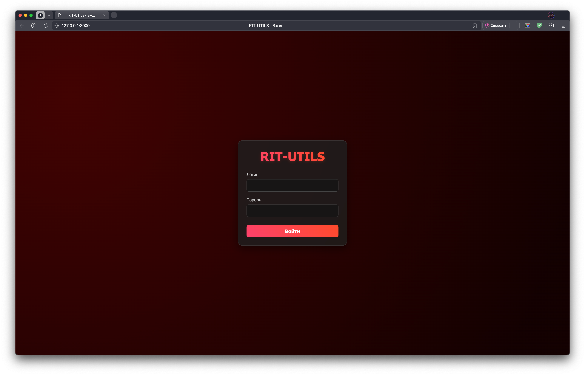
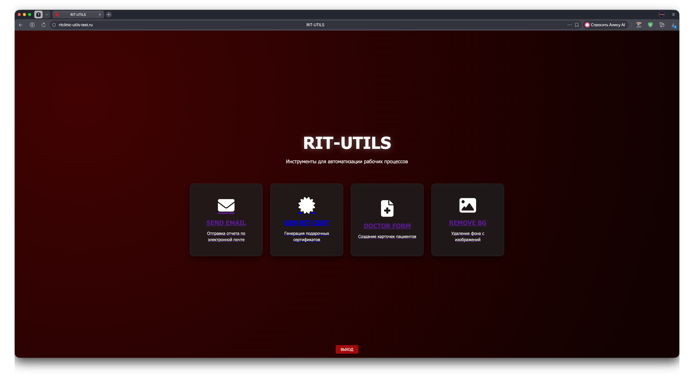
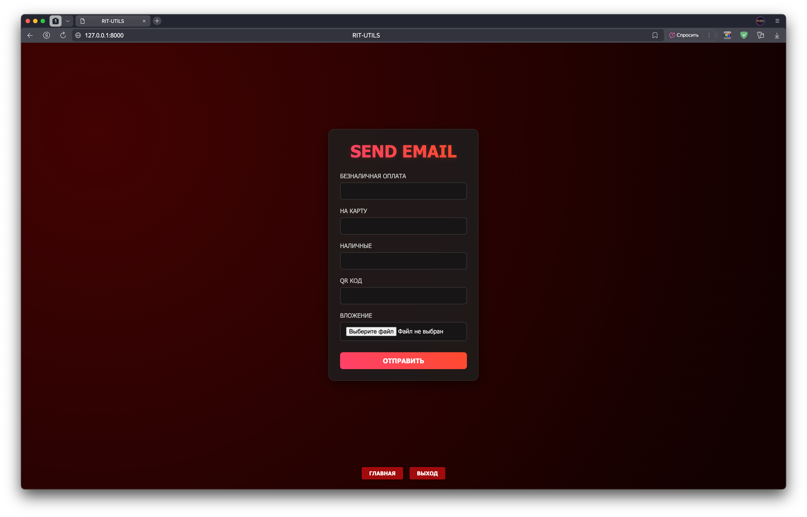
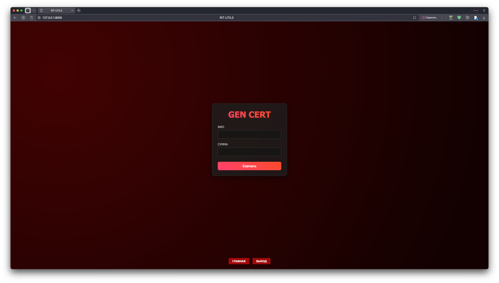
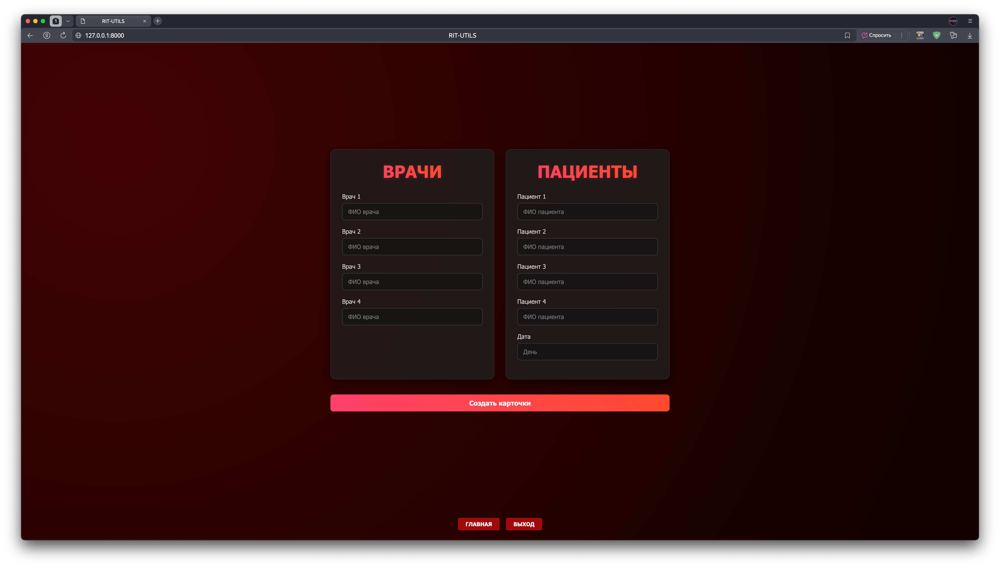

# rit-utils


Веб-приложение на FastAPI для автоматизации рабочих процессов.

## 📝 Описание

Проект предоставляет набор утилит для автоматизации рабочих процессов, включая:
- 🔐 Простую и безопасную авторизацию
- 📄 Генерацию сертификатов
- 🏥 Обработку форм
- 📧 Отправку email-уведомлений с вложениями
- 🛡️ JWT-авторизацию с refresh токенами

## 🔐 Безопасность

Приложение защищено системой аутентификации:
- **Логин/пароль** - авторизация пользователя
- **JWT токены** - защищенные сессии с автоматическим обновлением
- **Secure cookies** - защита от XSS и CSRF атак

## 🚀 Быстрый старт

### Требования
- Python 3.13
- Poetry (для управления зависимостями)

### Установка
1. Клонируйте репозиторий:
   ```bash
   git clone https://github.com/PROSHANTI/rit-utils.git
   cd rit-utils
   ```

2. Установите зависимости:
   ```bash
   poetry install
   ```

3. Добавьте необходимые файлы:
   Перед запуском добавьте требуемые файлы шаблонов в соответствующие директории (см. раздел "Дополнительные файлы").

4. Настройте переменные окружения:
   ```bash
   cp .env.examples .env
   nano .env
   ```

   **Обязательно настройте:**
   - `LOGIN` и `PASSWORD` - учетные данные для входа
   - `SEND_FROM` и `EMAIL_PASS` - настройки почты
   - `JWT_SECRET_KEY` - секретный ключ для JWT

5. Теперь вы можете войти в систему, используя заданные LOGIN и PASSWORD

### Запуск

**Локальная разработка**
```bash
poetry run uvicorn src.main:app --reload
```

**Продакшен через Docker**
```bash
docker-compose up -d
```

Приложение будет доступно по адресу: [http://localhost:8000](http://localhost:8000)

## 🐳 Docker

### Локальная разработка
```bash
# Сборка и запуск
docker-compose up -d

# Просмотр логов
docker-compose logs -f

# Остановка
docker-compose down
```

## ⚙️ Конфигурация

### Переменные окружения (.env)
```bash
# Email настройки
SEND_FROM=your_email@yandex.ru
EMAIL_PASS=your_password
ADDR_TO=recipient@example.com
BCC_TO=bcc@example.com

# Учетные данные для входа
LOGIN=admin
PASSWORD=your-admin-password

# JWT настройки
JWT_SECRET_KEY=your-super-secret-jwt-key-here
```

**Примечание**: JWT токены истекают через 15 минут, refresh токены - через 7 дней. Эти настройки жестко закодированы в коде.

## 🧪 Тестирование

Проект включает комплексную систему тестирования с **106 тестами**

### 📋 Прямое использование pytest

```bash
# Все тесты
poetry run pytest

# Конкретный файл
poetry run pytest tests/test_auth_login.py

# Конкретный тест
poetry run pytest tests/test_auth_login.py::TestLoginHandler::test_login_success

# С покрытием кода
poetry run pytest --cov=src --cov-report=html
```

### 🗂️ Структура тестов

```
tests/
├── conftest.py                     # Фикстуры и конфигурация pytest
├── test_auth_login.py              # 17 тестов аутентификации
├── test_auth_two_factor.py         # 18 тестов 2FA
├── test_auth_cookie_utils.py       # 4 теста cookie утилит
├── test_utils_email.py             # 8 тестов отправки email
├── test_utils_gen_cert.py          # 13 тестов генерации сертификатов
├── test_utils_doctor_form.py       # 11 тестов форм врачей
├── test_integration_endpoints.py   # 25 интеграционных тестов API
├── test_main.py                    # 10 тестов основного модуля
├── test_config.py                  # 2 теста конфигурации
└── README.md                       # Документация по тестам
```

### ✨ Особенности тестирования

- ✅ **Без запуска сервера** - все тесты работают изолированно
- ✅ **Полное мокирование** внешних зависимостей (SMTP, LibreOffice, файлы)
- ✅ **Тестовые переменные** окружения для безопасности
- ✅ **Автоматическая очистка** состояния между тестами
- ✅ **pytest-cov** для анализа покрытия кода
- ✅ **HTML отчеты** о покрытии в `htmlcov/`

## 📚 Документация

После запуска приложения доступна автоматически сгенерированная документация API:
- Swagger UI: [/docs](http://localhost:8000/docs)
- ReDoc: [/redoc](http://localhost:8000/redoc)

## 🔐 Процесс аутентификации

1. **Вход** → Введите логин/пароль из переменных окружения
2. **Доступ к приложению** → Автоматическое получение JWT токенов и доступ к функциям

## 📸 Скриншоты приложения

**Авторизация:**



**Главный экран:**



**Отправка письма:**



**Генерация сертификата:**



**Создание карточек:**



## 🏗️ Структура проекта
```
rit-utils/
├── src/                          # Исходный код приложения
│   ├── main.py                  # Основное FastAPI приложение
│   ├── config.py                # Конфигурация и загрузка переменных окружения
│   ├── auth/                    # Модуль аутентификации
│   │   ├── __init__.py          # Экспорт функций авторизации
│   │   ├── login.py             # JWT авторизация и сессии
│   │   └── cookie_utils.py      # Утилиты для работы с cookies
│   └── utils/                   # Утилиты
│       ├── __init__.py          # Экспорт утилит
│       ├── doctor_form/         # Модуль генерации карточек врача
│       │   └── doctor_form_handler.py  # Обработчик формы врача
│       ├── gen_cert/            # Модуль генерации сертификатов
│       │   └── gen_cert_handler.py     # Обработчик сертификатов
│       └── send_email/          # Модуль отправки email
│           ├── email_handler.py        # Обработчик отправки email
│           └── email_templates_examples.py # Примеры шаблонов
├── templates/                   # Jinja2 шаблоны
│   ├── css/                     # Стили CSS
│   │   ├── style_home.css       # Стили главной страницы
│   │   ├── style_login.css      # Стили страниц входа
│   │   └── style_utils.css      # Стили утилит
│   ├── login.html               # Страница входа
│   ├── home.html                # Главная страница
│   ├── send_email.html          # Отправка email
│   ├── gen_rit_cert.html        # Генерация сертификатов
│   ├── doctor_form.html         # Форма врача
│   ├── footer.html              # Подвал страниц
│   └── token-refresh.js         # Обновление JWT токенов
├── tests/                       # Тесты (106 тестов, 83% покрытие)
│   ├── conftest.py              # Фикстуры и конфигурация pytest
│   ├── test_auth_login.py       # Тесты аутентификации
│   ├── test_auth_cookie_utils.py # Тесты cookie утилит
│   ├── test_config.py           # Тесты конфигурации
│   ├── test_main.py             # Тесты основного модуля
│   ├── test_integration_endpoints.py # Интеграционные тесты API
│   ├── test_utils_doctor_form.py # Тесты форм врачей
│   ├── test_utils_email.py      # Тесты отправки email
│   └── test_utils_gen_cert.py   # Тесты генерации сертификатов
├── screenshots/                 # Скриншоты приложения
│   ├── auth.png                 # Страница авторизации
│   ├── home.png                 # Главная страница
│   ├── send_email.png           # Отправка email
│   ├── gen_cert.png             # Генерация сертификатов
│   └── doctor_form.png          # Форма врача
├── nginx/                      # Конфигурация Nginx
│   ├── nginx.conf              # Основная конфигурация Nginx
│   └── conf.d/                 # Конфигурации виртуальных хостов
│       └── rit-utils.conf      # Конфигурация для приложения
├── .env.examples               # Пример конфигурации переменных окружения
├── docker-compose.yml          # Docker Compose конфигурация
├── Dockerfile                  # Docker образ приложения
├── update.sh                   # Скрипт обновления приложения (автоопределение окружения)
├── pytest.ini                 # Конфигурация pytest
├── TESTING.md                  # Документация по тестированию
├── pyproject.toml              # Конфигурация Poetry
├── poetry.lock                 # Зафиксированные версии зависимостей
├── LICENSE                     # Лицензия Apache 2.0
└── README.md                   # Документация проекта
```

### 📋 Дополнительные файлы (не в репозитории)

Для полноценной работы проекта требуются дополнительные файлы, которые содержат конфиденциальную информацию и не включены в репозиторий:

- `src/utils/doctor_form/Бланк Врача.pptx` - шаблон презентации для карточек врача
- `src/utils/doctor_form/Бланк врача на печать.pptx` - готовый шаблон для печати
- `src/utils/gen_cert/Сертификат_шаблон.pptx` - шаблон сертификата
- `src/utils/send_email/email_templates.py` - настроенные email шаблоны

**Примечание**: Эти файлы необходимо добавить вручную для корректной работы всех функций приложения.

## 📦 Зависимости

### Основные зависимости:
- **FastAPI** (^0.116.1) - веб-фреймворк
- **Uvicorn** (^0.35.0) - ASGI сервер
- **AuthX** (^1.4.3) - JWT аутентификация
- **PyOTP** (^2.9.0) - TOTP двухфакторная аутентификация
- **QRCode** (^7.4.2) - генерация QR-кодов для 2FA
- **Python-multipart** (^0.0.20) - обработка форм и файлов
- **Python-dotenv** (^1.1.1) - работа с переменными окружения
- **Jinja2** (^3.1.6) - шаблонизатор HTML
- **Python-pptx** (^0.6.23) - работа с PowerPoint файлами
- **Pillow** (^10.1.0) - обработка изображений

### Зависимости для разработки:
- **pytest** (^8.4.1) - фреймворк тестирования
- **pytest-asyncio** (^1.1.0) - поддержка async тестов
- **pytest-mock** (^3.14.1) - мокирование в тестах
- **pytest-cov** (^6.2.1) - анализ покрытия кода
- **httpx** (^0.28.1) - HTTP клиент для тестирования

Полный список зависимостей можно найти в [pyproject.toml](./pyproject.toml)

## 🛡️ Безопасность

### Настройки безопасности:
- JWT токены истекают через 15 минут (настраивается)
- Refresh токены истекают через 7 дней
- Все cookies защищены флагами `httponly`, `secure`, `samesite`

## 📄 Лицензия
Проект распространяется под лицензией Apache 2.0. Подробнее см. [LICENSE](./LICENSE)
