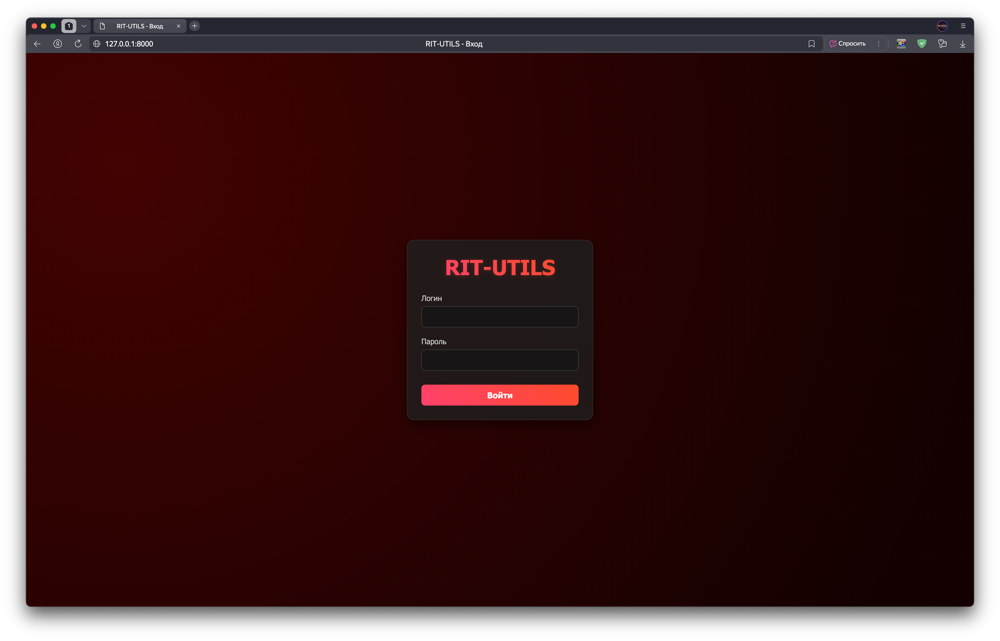
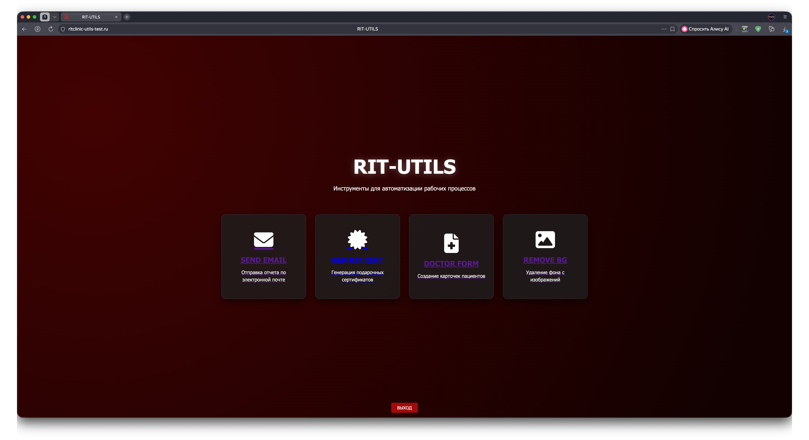
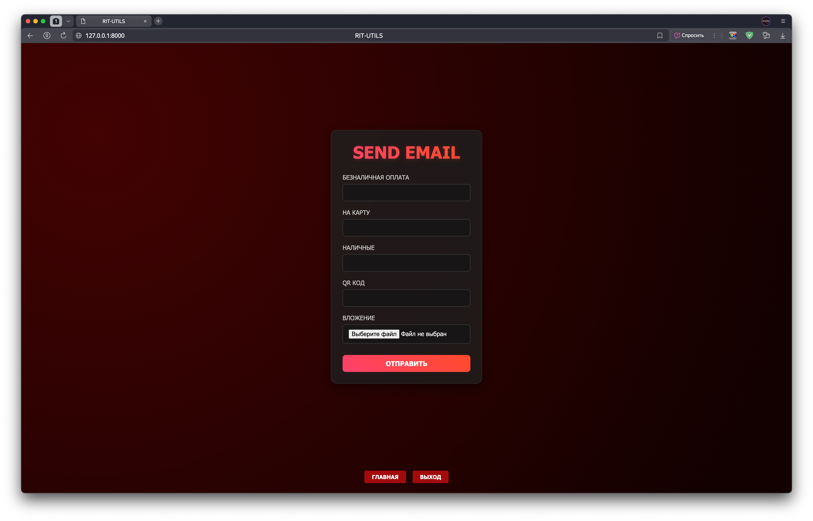
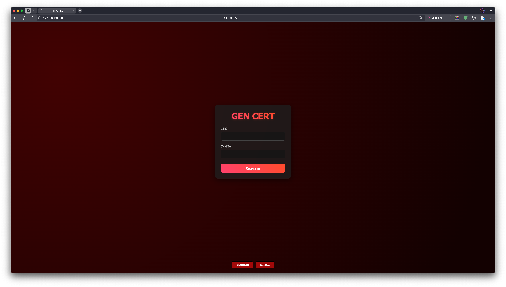
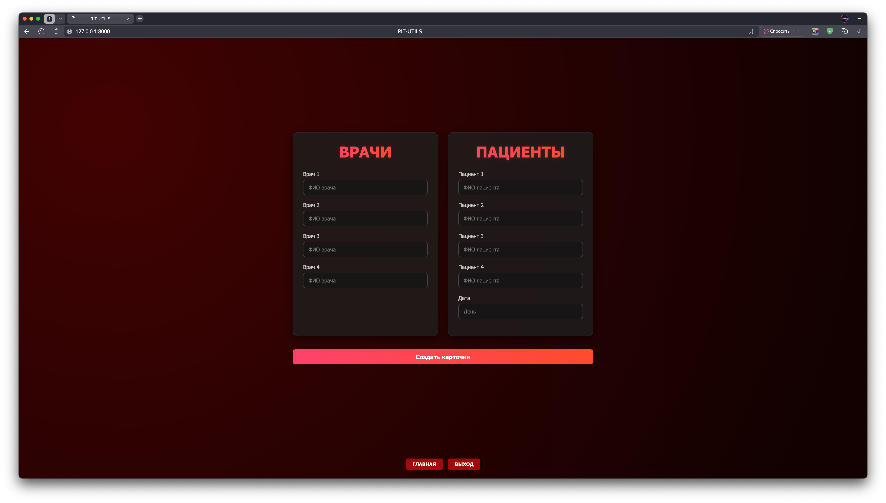
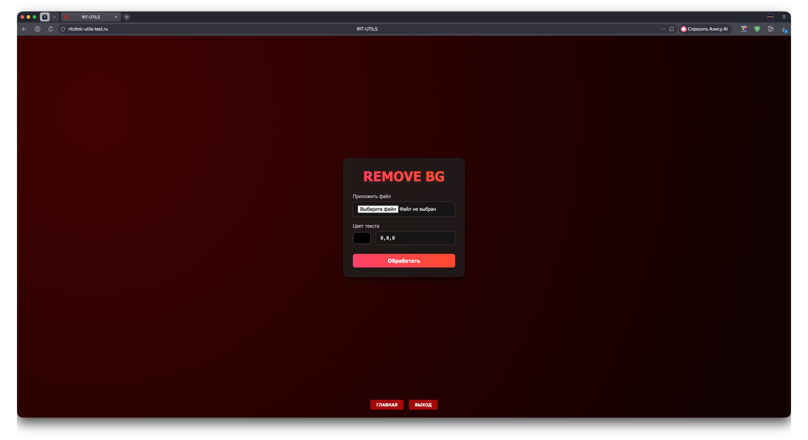

# rit-utils


Веб-приложение на FastAPI для автоматизации рабочих процессов.

## 📝 Описание

Проект предоставляет набор утилит для автоматизации рабочих процессов, включая:
- 🔐 Простую и безопасную авторизацию
- 📄 Генерацию сертификатов
- 🏥 Обработку форм
- 📧 Отправку email-уведомлений с вложениями
- 🛡️ JWT-авторизацию с refresh токенами

## 🔐 Безопасность

Приложение защищено системой аутентификации:
- **Логин/пароль** - авторизация пользователя
- **JWT токены** - защищенные сессии с автоматическим обновлением
- **Secure cookies** - защита от XSS и CSRF атак

## 🚀 Быстрый старт

### Требования
- Python 3.13
- uv 0.12.19 или новее (для управления зависимостями и виртуальным окружением)

### Установка
1. Клонируйте репозиторий:
   ```bash
   git clone https://github.com/PROSHANTI/rit-utils.git
   cd rit-utils
   ```

2. Установите зависимости:
   ```bash
   uv sync
   ```

   Команда создаёт виртуальное окружение `.venv` и устанавливает зависимости из
   `uv.lock`: пакеты для работы приложения и группу `dev` с линтерами и тестами.
   Для установки только рабочих зависимостей используйте `uv sync --no-dev`.

3. Добавьте необходимые файлы:
   Перед запуском добавьте требуемые файлы шаблонов в соответствующие директории (см. раздел "Дополнительные файлы").

4. Настройте переменные окружения:
   ```bash
   cp .env.examples .env
   nano .env
   ```

   **Обязательно настройте:**
   - `LOGIN` и `PASSWORD` - учетные данные для входа
   - `SEND_FROM` и `EMAIL_PASS` - настройки почты
   - `JWT_SECRET_KEY` - секретный ключ для JWT
   - `NGINX_SERVER_NAME` - имя сервера для NGINX и IP

5. После запуска приложения войдите в систему, используя заданные `LOGIN` и `PASSWORD`.

### Запуск

**Локальная разработка**
```bash
uv run uvicorn src.main:app --reload
```

**Продакшен через Docker**
```bash
docker-compose up -d
```

Для локального запуска Uvicorn стандартный адрес: [http://localhost:8000](http://localhost:8000).

## 🐳 Docker

CI собирает и публикует готовый Docker-образ с runtime-зависимостями, установленными
через uv. На сервере запускается этот образ, поэтому устанавливать uv на сервере
не требуется. Файл `.env` и приватные шаблоны остаются на сервере и передаются
контейнеру через настройки Docker Compose. CI собирает образ из репозитория, в
котором приватных шаблонов нет. В production Compose они монтируются с сервера.

### Локальная разработка
```bash
# Сборка и запуск
docker-compose up -d

# Просмотр логов
docker-compose logs -f

# Остановка
docker-compose down
```

## ⚙️ Конфигурация

### Переменные окружения (.env)
```bash
SEND_FROM=your_email@yandex.ru
EMAIL_PASS=your_password
ADDR_TO=recipient@example.com
BCC_TO=bcc@example.com

LOGIN=admin
PASSWORD=your-admin-password

JWT_SECRET_KEY=your-super-secret-jwt-key-here
NGINX_SERVER_NAME=localhost
```

**Примечание**:
- JWT токены истекают через 15 минут, refresh токены - через 7 дней. Эти настройки жестко закодированы в коде.
- `NGINX_SERVER_NAME` используется для автоматической генерации конфигурации nginx из шаблона. Укажите домен и IP адрес вашего сервера.

## Логи приложения

Логи приложения выводятся в stdout и доступны в Docker:

```bash
docker logs -f rit-utils-app
```

Формат записи: время, уровень, модуль, функция и сообщение. По умолчанию используется
уровень `INFO`; для подробных логов вспомогательных функций задайте `LOG_LEVEL=DEBUG`
в `.env` и пересоздайте контейнер приложения. Пароли, токены и адреса из настроек
маскируются в сообщениях и стеке исключения.

Ошибка SMTP `525` с текстом `SMTP disabled` отображается как отключение SMTP для
почтового ящика. Для остальных ошибок авторизации предлагается проверить настройки
доступа. Технические подробности общей ошибки отправки доступны в серверных логах.

## Организация кода

HTTP-маршруты находятся в `src/routers.py`: методы `ApplicationRouter`
регистрируются в `APIRouter`. `WebApplication` в `src/application.py` подключает
роутер, статические файлы и обработчики ошибок. В `src/main.py` остаются создание
приложения и запуск Uvicorn. Авторизацией управляет
`AuthenticationService`, отправкой отчёта — `EmailHandler` и `EmailService`,
документами — `CertificateGenerator` и `DoctorFormGenerator`, изображениями —
`RemoveBackgroundHandler` и `BackgroundRemover`.

Данные отчётов, форм и настройки представлены dataclass-объектами. Публичные
методы расположены выше приватных. `EmailService._normalize_message` убирает
пробелы внутри скобок, сохраняя переносы строк; незаполненные суммы в письмо
не попадают.

## 🧪 Тестирование

Тесты покрывают авторизацию, обработчики утилит и HTTP API.

### Проверки проекта

После установки зависимостей через `uv sync` выполните:

```bash
uv run black --check .
uv run ruff check .
uv run mypy
uv run pytest
```

### 📋 Прямое использование pytest

```bash
# Все тесты
uv run pytest

# Конкретный файл
uv run pytest tests/test_auth_login.py

# Конкретный тест
uv run pytest tests/test_auth_login.py::TestLoginHandler::test_login_success
```

### 🗂️ Структура тестов

```
tests/
├── conftest.py                     # Фикстуры и конфигурация pytest
├── test_auth_login.py              # Тесты аутентификации
├── test_auth_cookie_utils.py       # Тесты cookie утилит
├── test_utils_email.py             # Тесты отправки email
├── test_utils_gen_cert.py          # Тесты генерации сертификатов
├── test_utils_doctor_form.py       # Тесты форм врачей
├── test_utils_remove_bg.py        # Тесты удаления фона с изображений
├── test_integration_endpoints.py   # Интеграционные тесты API
├── test_main.py                    # Тесты основного модуля
└── test_config.py                  # Тесты конфигурации
```

### ✨ Особенности тестирования

- ✅ **Без запуска сервера** - все тесты работают изолированно
- ✅ **Полное мокирование** внешних зависимостей (SMTP, LibreOffice, OpenCV, файлы)
- ✅ **Тестовые переменные** окружения для безопасности
- ✅ **Автоматическая очистка** состояния между тестами

## 🔐 Процесс аутентификации

1. **Вход** → Введите логин/пароль из переменных окружения
2. **Доступ к приложению** → Автоматическое получение JWT токенов и доступ к функциям

## 📸 Скриншоты приложения

**Авторизация:**



**Главный экран:**



**Отправка письма:**



**Генерация сертификата:**



**Создание карточек:**



**Удаление фона с изображений:**



### 📋 Дополнительные файлы (не в репозитории)

Для полноценной работы проекта требуются дополнительные файлы, которые содержат конфиденциальную информацию и не включены в репозиторий:

- `src/utils/doctor_form/Бланк Врача.pptx` - шаблон презентации для карточек врача
- `src/utils/doctor_form/Бланк врача на печать.pptx` - готовый шаблон для печати
- `src/utils/gen_cert/Сертификат_шаблон.pptx` - шаблон сертификата
- `src/utils/send_email/email_templates.py` - настроенные email шаблоны

**Примечание**: Эти файлы необходимо добавить вручную для корректной работы всех функций приложения.

## 📦 Зависимости

Пакеты для работы приложения перечислены в массиве `dependencies` секции `[project]`
файла [pyproject.toml](./pyproject.toml). Все линтеры, тестовые инструменты и пакеты
с аннотациями типов находятся в единственной группе `dev` секции `[dependency-groups]`.
Точные версии всех зависимостей зафиксированы в `uv.lock`.

```bash
# Только зависимости для работы приложения (так же устанавливаются в Docker)
uv sync --locked --no-dev

# Разработка: рабочие зависимости, линтеры и тесты
uv sync --locked
```

### Основные зависимости:
- **FastAPI** - веб-фреймворк
- **Uvicorn** - ASGI сервер
- **AuthX** - JWT аутентификация
- **PyOTP** - TOTP двухфакторная аутентификация
- **QRCode** - генерация QR-кодов для 2FA
- **Python-multipart** - обработка форм и файлов
- **Python-dotenv** - работа с переменными окружения
- **Jinja2** - шаблонизатор HTML
- **Python-pptx** - работа с PowerPoint файлами
- **Pillow** - обработка изображений
- **OpenCV** - удаление фона изображений

### Группа `dev`:

- **Black** - форматирование кода
- **Ruff** - статические проверки
- **mypy** - проверка типов
- **types-pillow**, **types-qrcode** - аннотации типов сторонних библиотек
- **pytest** - фреймворк тестирования
- **pytest-asyncio** - поддержка async тестов
- **pytest-mock** - мокирование в тестах
- **httpx** - HTTP клиент для тестирования

## 🛡️ Безопасность

### Настройки безопасности:
- JWT токены истекают через 15 минут (настраивается)
- Refresh токены истекают через 7 дней
- Все cookies защищены флагами `httponly`, `secure`, `samesite`

## 📄 Лицензия
Проект распространяется под лицензией Apache 2.0. Подробнее см. [LICENSE](./LICENSE)
